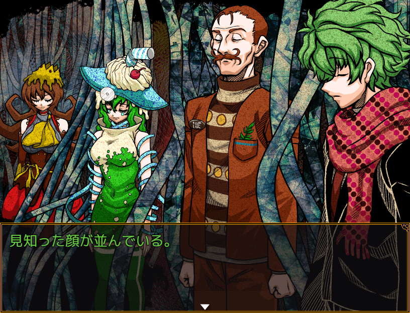
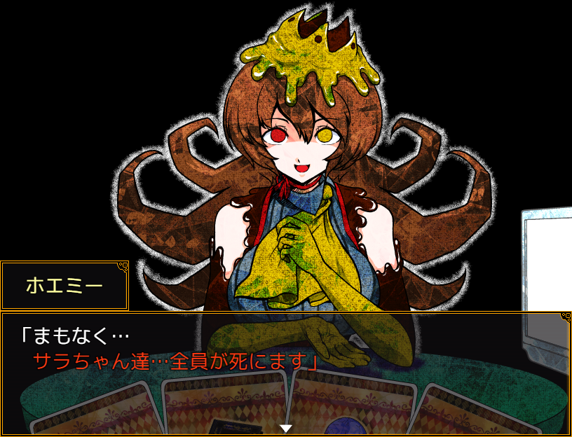
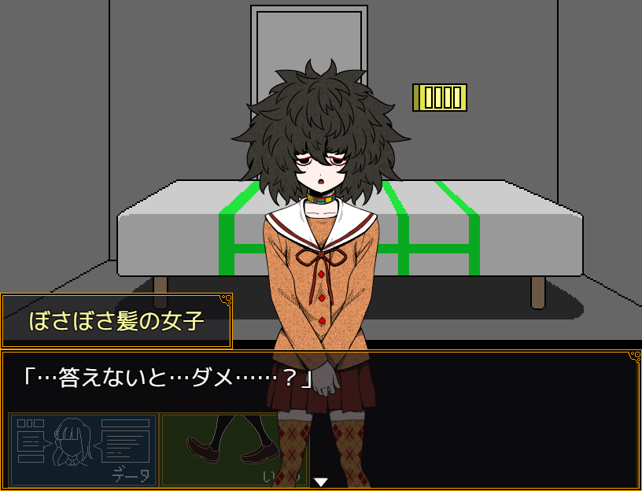
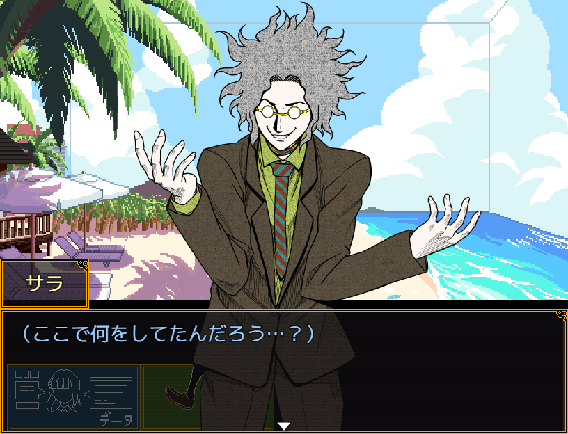

Bonne année 2026 à tous ! 🎉

On peut commencer l'année avec de quoi manger !  
Au réveillon du Nouvel An, des [news](https://store.steampowered.com/news/app/2067780/view/536621842119526775) ont été postées sur la page Steam de Your Turn To Die !

En [février 2025](https://x.com/nannkizum/status/1892773710865567886), Nankidai a annoncé viser la fin du développement à la fin de l'année.
Malheureusement, cela n'a pas été le cas.

> Nous voulions terminer le Early Access et faire une sortie complète en 2025.

A déclaré 0UPGAMES, producteur du jeu, dans l'annonce Steam.

> Cependant, puisque nous nous sommes rendu compte qu'il n'était pas possible de terminer le dernier chapitre de manière satisfaisante à temps, nous avons donc choisi de retarder la sortie.

Ils nous assurent que le jeu sera terminé, et *qu'il sortira en 2026*.

<figure>
	
	<figcaption>Des personnes familières sont alignées devant nous.</figcaption>
</figure>

<figure>
	
	<figcaption>« Bientôt... Toi, Sara, mais aussi les autres... Vous allez périr. »</figcaption>
</figure>

<figure>
	
	<figcaption>« ... Suis-je vraiment obligée... de répondre...? »</figcaption>
</figure>

<figure>
	
	<figcaption>(Qu'est-ce que je fabrique ici...?)</figcaption>
</figure>
