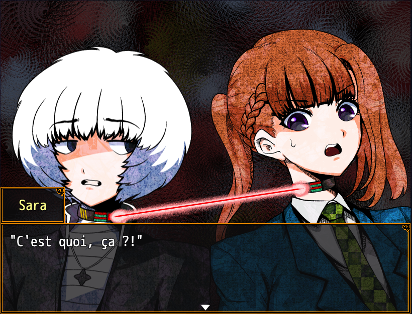
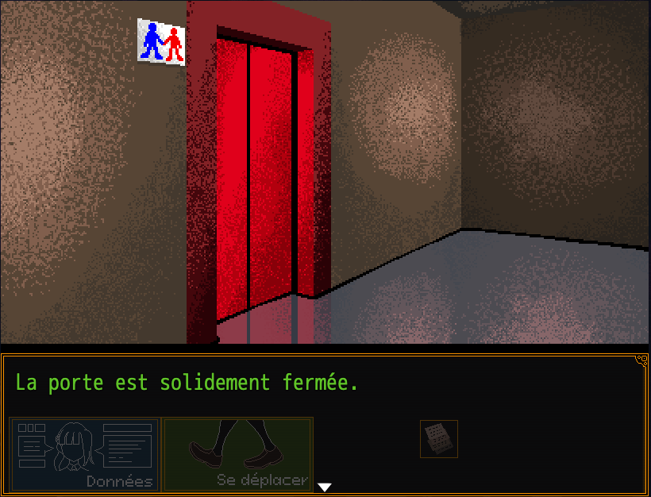
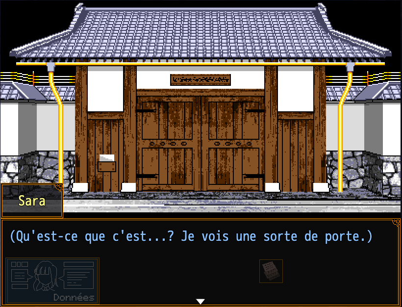
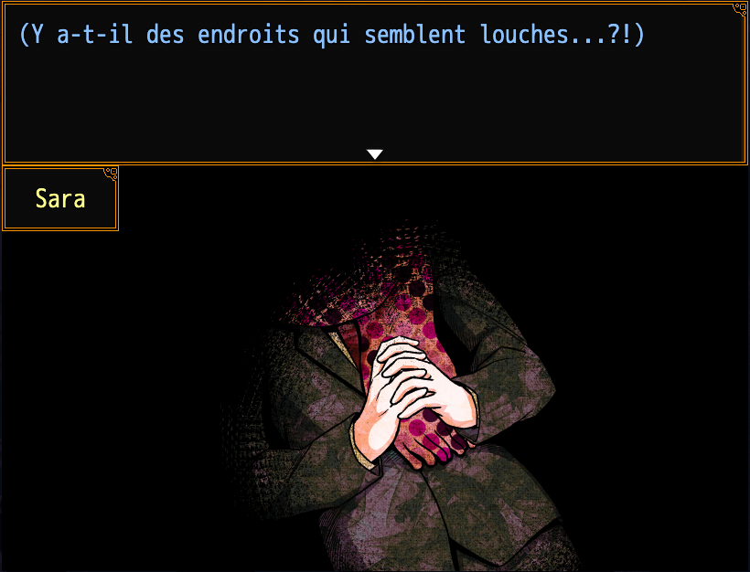

import Stat from "../components/Stat.astro";
import StatContainer from "../components/StatContainer.astro";

Bonjour à tous&nbsp;!

L'année 2026 démarre sur des chapeaux de roues pour Your Turn To Die en français&nbsp;! 
En effet, nous avons le plaisir de vous annoncer que *la section A du chapitre 3, partie 1 est désormais entièrement traduite*&nbsp;! 
Vous pouvez d'ores et déjà y [jouer sur notre site](/jouer/)&nbsp;! 

<StatContainer>
    <Stat value="1 000+" description="Répliques traduites" />
    <Stat value="126 000+" description="Caractères" />
    <Stat value="9" description="Images traduites" />
</StatContainer>

Cette annonce est également un appel : *nous avons besoin de relecteurs*&nbsp;!
En effet, le chapitre 3 partie 1 section A ayant plusieurs routes possibles selon les choix et beaucoup de dialogues alternatifs,
il serait idéal d'avoir plusieurs relecteurs et points de vue qui jouent aux différentes routes pour couvrir le plus de dialogues possibles,
afin de corriger les lignes comportant des erreurs (comme des manques de traduction, des fautes d'orthographe ou de grammaire, ou des erreurs de ponctuation).
Nous comptons donc sur vous&nbsp;!
Si vous désirez nous aider dans cette démarche, veuillez consulter notre serveur discord dans lequel nous vous expliquerons comment remonter vos suggestions. 

Merci pour votre lecture, et bon jeu !

